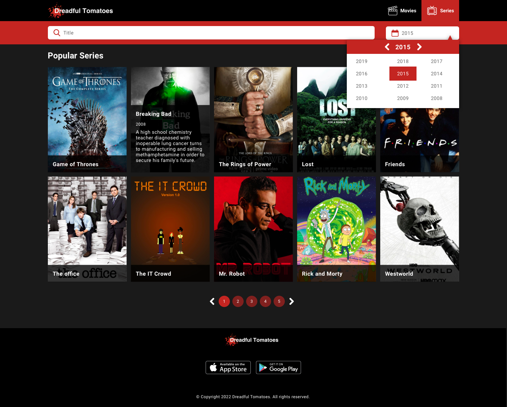
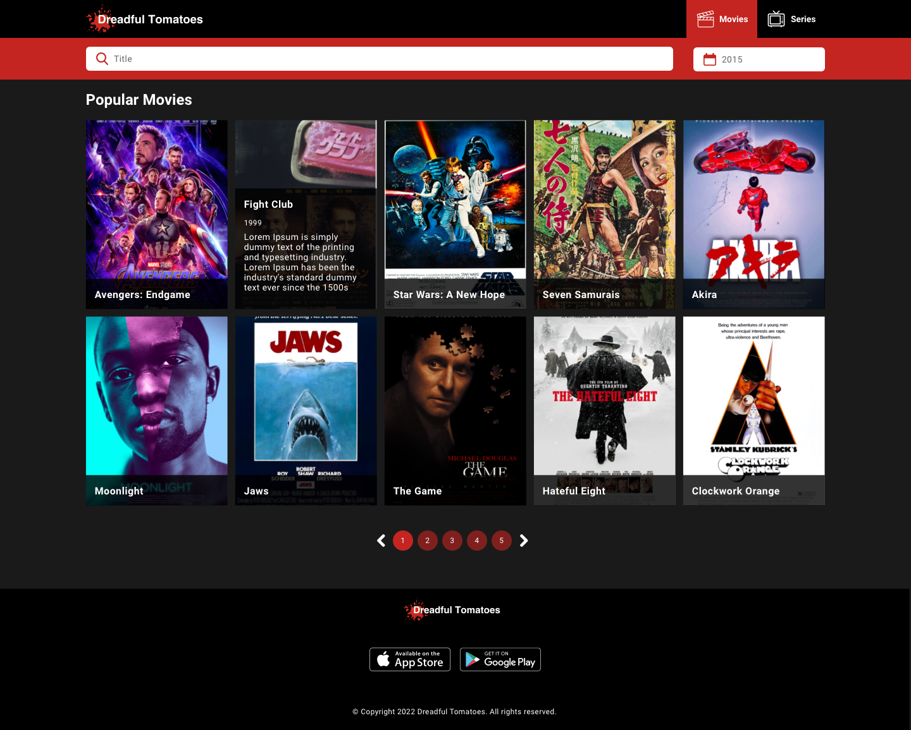

# Dreadful Tomatoes

Dreadful Tomatoes is a new platform to find new movies and TV shows. The main objective is to
help users to find information about their favourite TV shows and movies.

To do so, the company has to create a new web app that allow users to do some fancy things.

## What do you have to do?

Dreadful Tomatoes needs to implement an awesome webpage where the users could view information
about almost every new TV Shows and movie.

The Design team has sent us the new interface which has to be implemented. As you could see,
there are three different pages.

- The first page is a landing page where user could select whether she wants to see TV shows
  or movies and some claims and logo of Dreadful Tomatoes
- The second one is the list of TV shows. Here, the user could filter TV shows by title and
  release year. In that page the user will see a list of cards with the title, year, description
  and image from each TV show. 10 cards per page, sorted by most recent release year.
- The third one is quite similar, but for the movies. The user could filter by title and
  release year as well, to see a list of cards with the information of every movie.

Here you could see the design of the 3 pages:

Home page:

TV shows page:

Movies page:

#### Considerations

- Through [this Figma link (account required)](https://www.figma.com/file/KMDxOwdjYz3sVGJ1j9zptF/Dreadful-Tomatoes?type=design&node-id=0-1&mode=design) you can download all the
  assets to start!
- To obtain the data of the TV Shows and Movies, you have to request [this file](https://raw.githubusercontent.com/elias-soykat/dev-task/master/dreadful-tomatoes..json)
- Use SCSS or SASS or TailwdindCSS to manage your stylesheets
- Use any component you want in the date picker to allow the user select the year
- Pay attention to hover effects (Home and Shows/Movies cards)

## Technical Requirements

- Create reusable components
- Create a **clean, maintainable and well-designed** code
- Test your code until you are comfortable with that

## How to submit your solution

- Push your code to the `deve` branch - we encourage you to commit regularly to show your thinking process was.
- **Create a new Pull Request** to `main` branch & **merge it**.

Once merged you **won't be able to change or add** anything to your solution, so double-check that everything is as
you expected!
